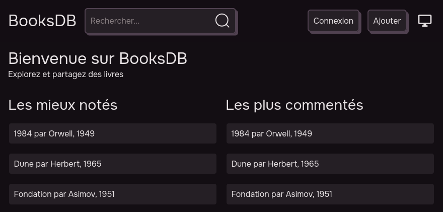

# BooksDB
_School project to learn Flask and SQLite_  

BooksDB is a small Flask app to manage a book database with comment and rating  
You can add / delete / modify books and comments

### Screenshots

### Roadmap
- [x] User account to manage book and comment
- [x] Admin panel
- [ ] Local AI features
- [ ] Mobile version
- [ ] English version

### How to run
Just execute `run.sh`